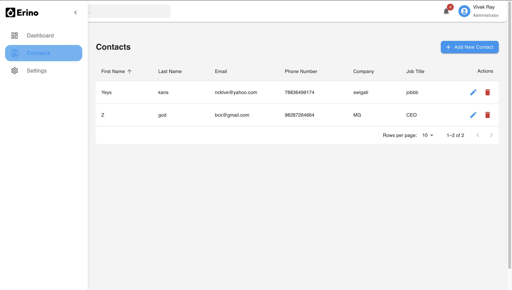
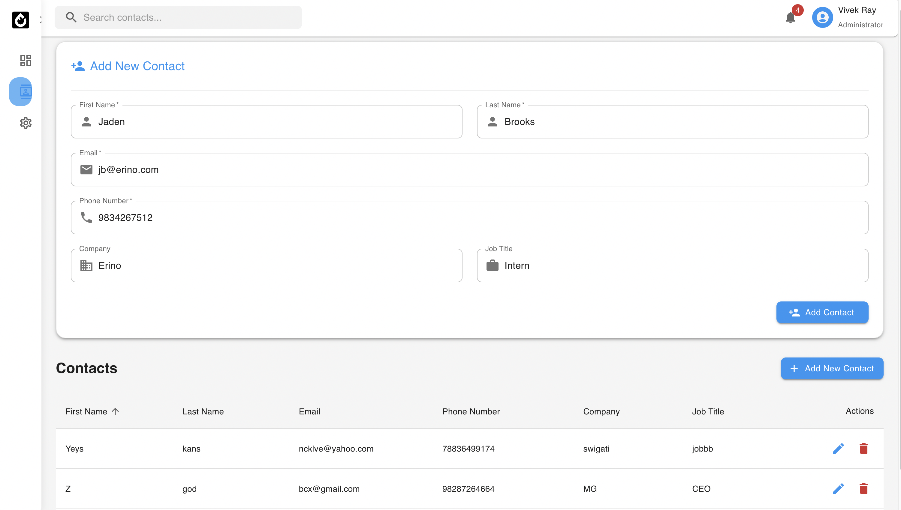
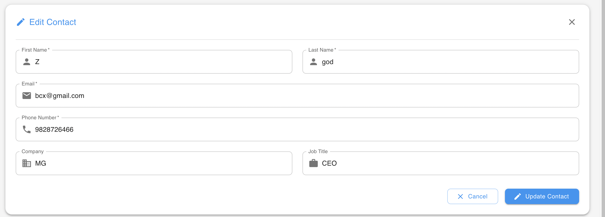
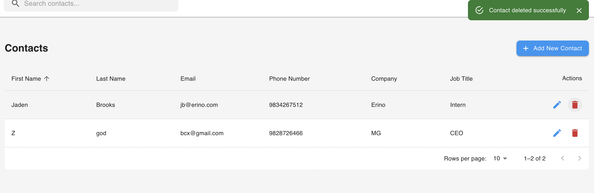
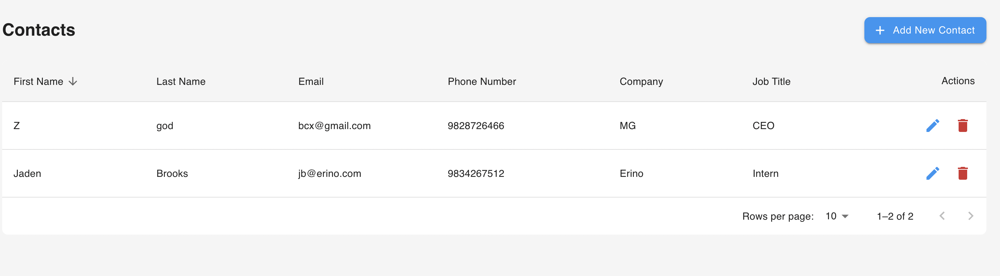

# Contact Management System - CRM Feature

A full-stack MERN application for managing contacts, built as part of the Erino SDE Internship Assignment.

## 🚀 Features

- Create, read, update, and delete contacts
- Sortable and paginated contact list
- Responsive Material-UI design
- Real-time form validation
- Search functionality
- Error handling and notifications

## 🛠️ Technical Stack

### Frontend
- React.js
- Material-UI (MUI)
- Axios for API calls
- React Hooks for state management

### Backend
- Node.js
- Express.js
- MongoDB with Mongoose
- Environment variables for configuration

### Database
- MongoDB Atlas

## 💾 Database Choice: MongoDB

MongoDB was chosen for this project for several key reasons:

1. **Flexible Schema**: The document-based model allows for easy schema modifications as requirements evolve.
2. **JSON Compatibility**: Natural integration with JavaScript/Node.js stack.
3. **Scalability**: Horizontal scaling capabilities for growing contact lists.
4. **Query Performance**: Built-in indexing for optimized search operations.
5. **Rich Querying**: Powerful query capabilities for filtering and sorting contacts.

## 📊 Database Schema Script

```javascript
// MongoDB Schema (using Mongoose)

const mongoose = require('mongoose');

const contactSchema = new mongoose.Schema({
  firstName: {
    type: String,
    required: [true, 'First name is required']
  },
  lastName: {
    type: String,
    required: [true, 'Last name is required']
  },
  email: {
    type: String,
    required: [true, 'Email is required'],
    unique: true,
    validate: {
      validator: function(v) {
        return /\S+@\S+\.\S+/.test(v);
      },
      message: props => `${props.value} is not a valid email!`
    }
  },
  phoneNumber: {
    type: String,
    required: [true, 'Phone number is required'],
    validate: {
      validator: function(v) {
        return /\d{10,}/.test(v);
      },
      message: props => `${props.value} is not a valid phone number!`
    }
  },
  company: {
    type: String,
    required: false
  },
  jobTitle: {
    type: String,
    required: false
  }
}, {
  timestamps: true // Adds createdAt and updatedAt fields automatically
});

// Compound index for better search performance
contactSchema.index({ firstName: 1, lastName: 1 });
// Index for email searches and ensuring uniqueness
contactSchema.index({ email: 1 }, { unique: true });

// Pre-save middleware for data cleaning
contactSchema.pre('save', function(next) {
  // Trim whitespace from string fields
  this.firstName = this.firstName.trim();
  this.lastName = this.lastName.trim();
  this.email = this.email.trim().toLowerCase();
  if (this.company) this.company = this.company.trim();
  if (this.jobTitle) this.jobTitle = this.jobTitle.trim();
  next();
});

module.exports = mongoose.model('Contact', contactSchema);
```

## 🏗️ Project Structure

```tree
├── client/
│   ├── src/
│   │   ├── components/
│   │   │   ├── common/
│   │   │   ├── layout/
│   │   │   ├── ContactForm.jsx
│   │   │   └── ContactsTable.jsx
│   │   ├── api.js
│   │   ├── App.js
│   │   └── theme.js
├── server/
│   ├── models/
│   │   └── Contact.js
│   ├── index.js
│   └── .env
```
## 🚀 Setup Instructions

1. **Clone the repository**
   ```bash
    git clone [repository-url]
2. **Backend Setup**
   ```bash
        cd server
        npm install
3. **Create a .env file:**
   ```bash
        MONGODB_URI=your_mongodb_connection_string
        PORT=3001
4. **Frontend Setup**
   ```bash
    cd client
    npm install
5. **Run the Application** <br>
    Start backend (from server directory)
     ```bash
    npm start
  <br>
    Start frontend (from client directory)
    
    npm start

## 🧪 Testing

  Run the test suite:
    npm test

🛠️ Technical Decisions & Implementation

    Backend Implementation

        Validation: Mongoose schemas handle data validation
        Error Handling: Comprehensive error handling for duplicate entries and validation failures
        API Structure: RESTful API design with clear endpoints for each operation

    Frontend Implementation

        Component Structure: Modular components for maintainability
        State Management: React hooks for efficient state management
        UI/UX: Material-UI components for consistent design
        Form Handling: Real-time validation and error feedback


## 💭 Challenges & Solutions

1. *Challenge: Handling real-time form validation*


    Solution: Implemented custom validation hooks with Material-UI's error handling

2. *Challenge: Managing complex state for table sorting and pagination*


    Solution: Created dedicated state management for table operations

3. *Challenge: Ensuring consistent error handling across the stack*

   
    Solution: Implemented a standardized error handling system with appropriate HTTP status codes


## APP UI
1. *Main Page*


1. *Add New Contact*


1. *Updating Contact*


1. *Deleting Contact*


1. *Sorting Accodring to Names in Descending Order*


